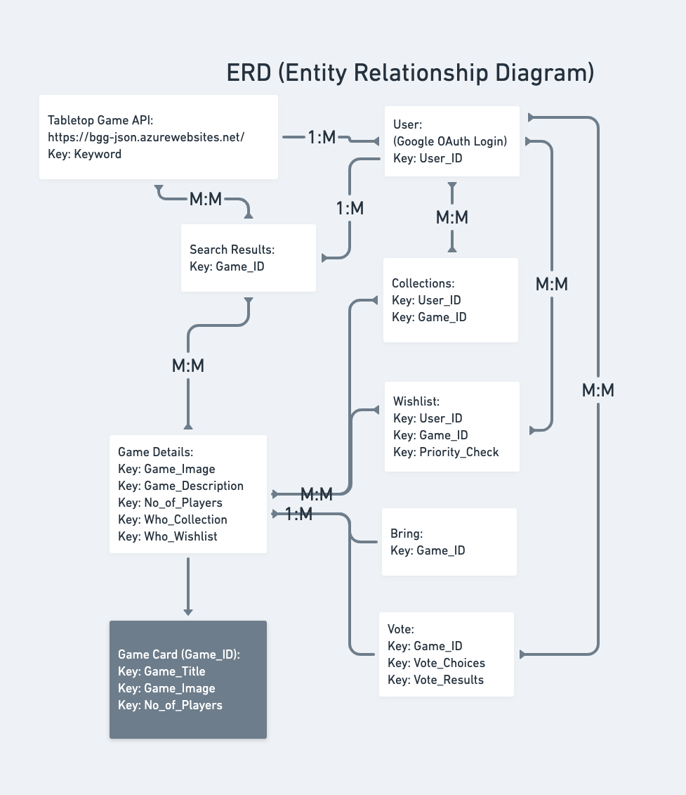
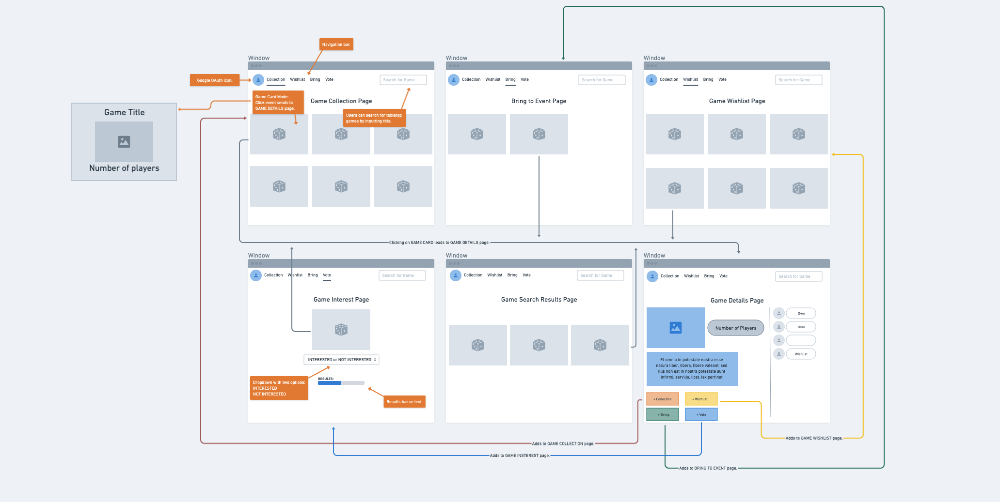
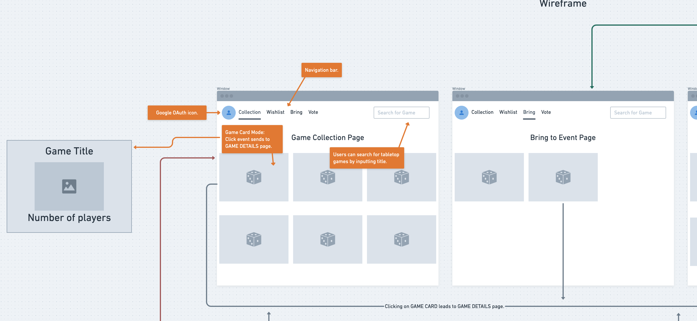
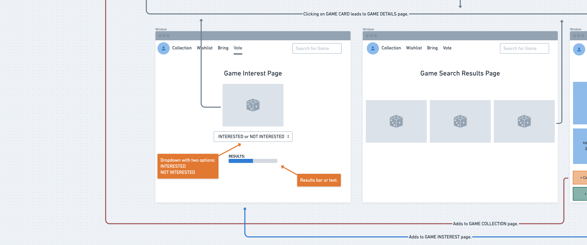
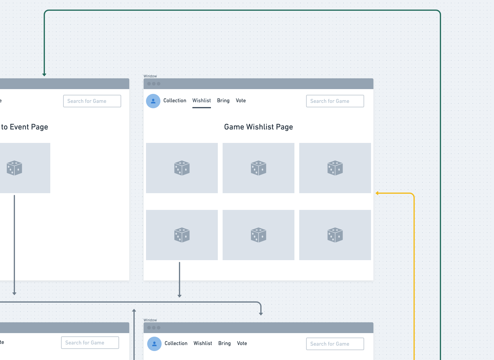
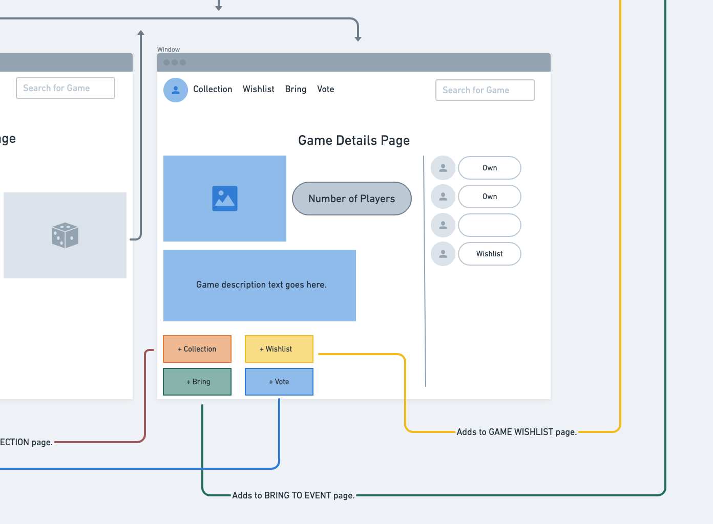

# Tabletop Game Tracker Project 02:

# Description:
### With this tabletop game tracker, users are able to keep track of their board game libraries, wishlists as well as add games to a "bring to event" and/or "interest vote" page.

# Deployment Link: ()

# Images:

# Technologies:
- HTML
- CSS
- JavaScript
- Node.js
- Express.js
- MongoDB Atlas
- Mongoose
- Google APIs
- getbootstrap.com

# Pseudocode Outline:

# Detailed Pseudocode:
>

# Stretch Goals:
>

# Resources and References:
// https://console.developers.google.com/apis/dashboard
// https://cloud.mongodb.com/v2
// https://getbootstrap.com/docs/4.0/components/navs/