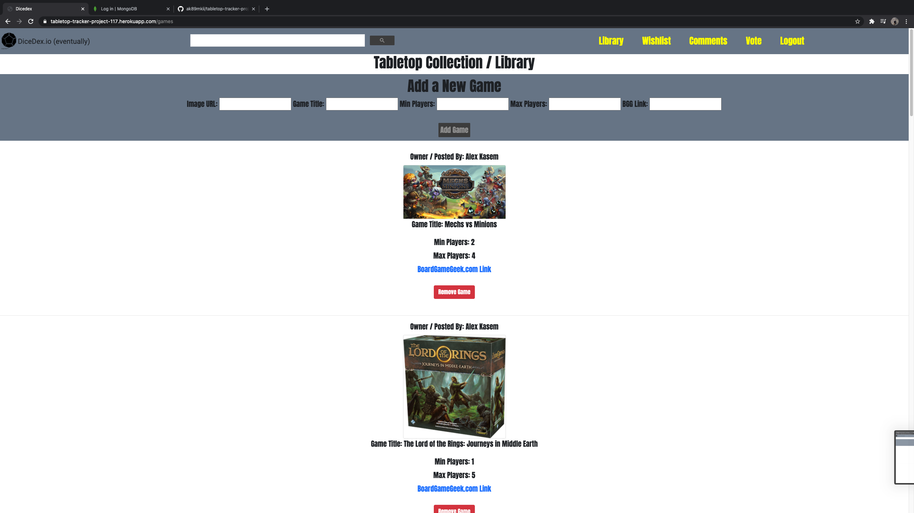
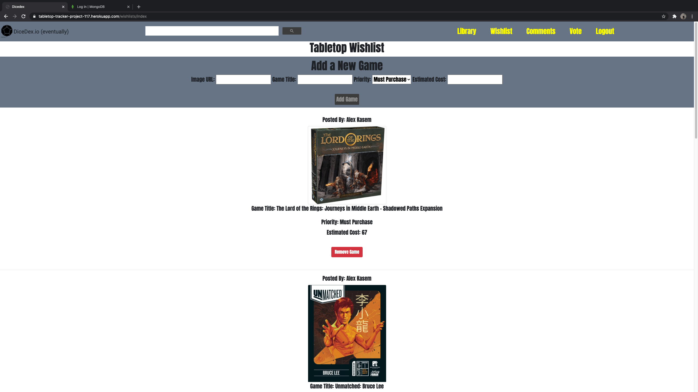
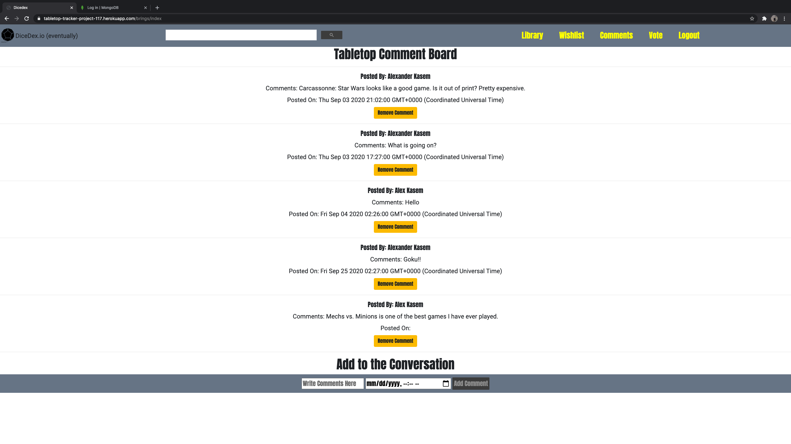

# DiceDex: Tabletop Game Tracker Project 02:

# Description:
### With this tabletop game tracker, users are able to add keep track of a group sourced board game library, wishlist, as well as write comments and/or post prospective games on a vote page.

# Deployment Link: (https://tabletop-tracker-project-117.herokuapp.com/users)

# Images:

# Technologies:
- HTML
- CSS
- JavaScript
- Node.js
- Express.js
- MongoDB Atlas
- Mongoose
- Google APIs
- Google Programmable Search
- Google Fonts
- getbootstrap.com
- thenounproject.com
- boardgamegeek.com

# Getting Started:
// Heroku Deplyment: https://tabletop-tracker-project-117.herokuapp.com/users
// Trello Board: https://trello.com/b/n5H1teBr/project-02-tabletop-game-tracker

# Next Steps:
>Add a "bring to event" page.

**Game details view.**

>Enhanced user specific features:
- Library / wishlist filter options.
- Group create functionality.

# Resources and References:
// https://console.developers.google.com/apis/dashboard
// https://cloud.mongodb.com/v2
// https://getbootstrap.com/docs/4.0/components/navs/
// https://thenounproject.com/term/dice/10652/
// https://medium.com/codingthesmartway-com-blog/getting-started-with-axios-166cb0035237
// https://stackoverflow.com/questions/12909332/how-to-logout-of-an-application-where-i-used-oauth2-to-login-with-google
// https://github.com/Shippable/support/issues/220
// https://stackoverflow.com/questions/41411155/does-bootstrap-4-have-a-built-in-horizontal-divider
// https://boardgamegeek.com/
// https://tenor.com/search/d20-gifs